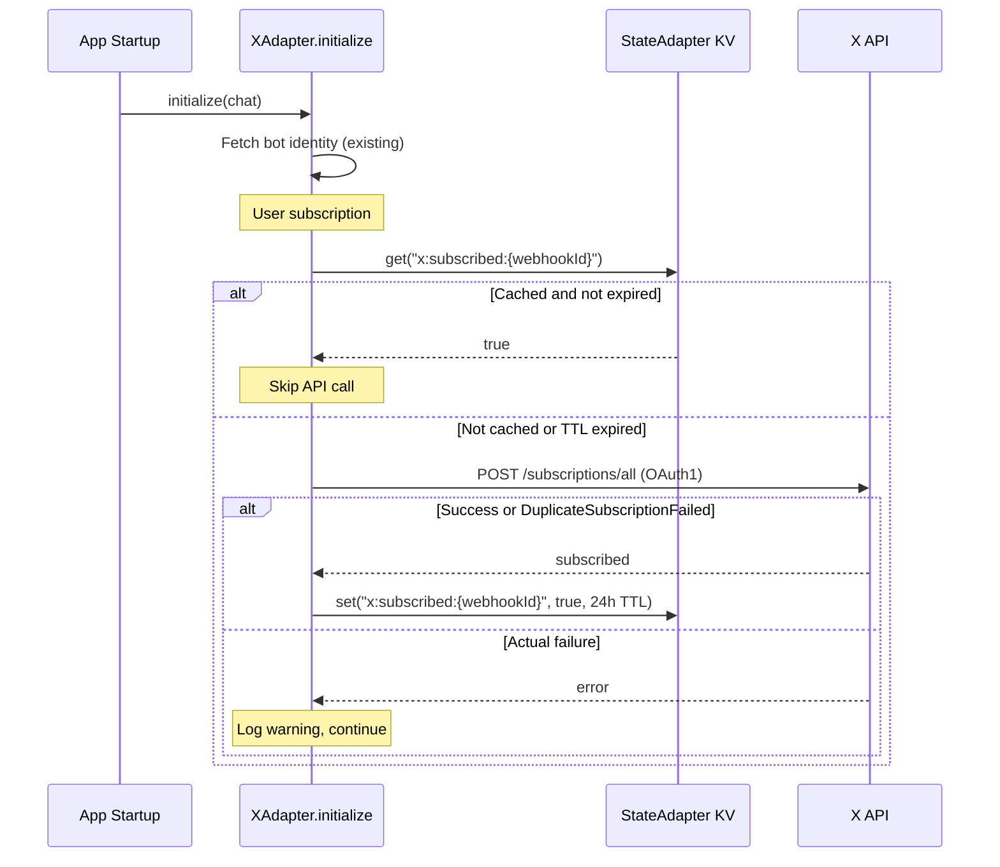

# X Webhook Auto-Subscription

## Context

The X Account Activity API requires three steps before events are delivered:

1. CRC challenge handler -- **already implemented** in the adapter
2. Webhook URL registration -- **already done** via X developer dashboard
3. User subscription via
   `POST /2/account_activity/webhooks/:id/subscriptions/all` (OAuth1 auth) --
   **this is what we're adding**

The webhook is registered on X's dashboard, which gives you a `webhook_id`. The
adapter needs that ID to subscribe the authenticated user so events start
flowing.

## Architecture



## Key Design Decisions

- `**webhookId` is a required config field (from env var `X_WEBHOOK_ID`). The
  webhook is pre-registered on X's dashboard. No auto-registration needed.
- **KV cache with 24-hour TTL**: On most cold starts, KV returns cached
  subscription status and we skip the API call entirely. Once every 24 hours,
  the TTL expires and we re-call subscribe (idempotent). This self-heals if a
  subscription is ever lost.
- `**DuplicateSubscriptionFailed` treated as success: The subscribe call is
  idempotent. If already subscribed, X returns this error, which we treat as
  confirmation.
- **Graceful failures**: All subscription logic is wrapped in try/catch. If it
  fails, the adapter logs a warning and continues -- CRC handling and incoming
  webhook processing still work normally.
- **No Bearer token needed**: The subscribe endpoint uses OAuth1 (user context),
  which the adapter already has credentials for (`apiKey`, `apiSecret`,
  `accessToken`, `accessTokenSecret`).

## Files to Change

### 1. `[packages/adapter-x/src/types.ts](packages/adapter-x/src/types.ts)`

Add to `XAdapterConfig`:

```typescript
/** Webhook ID from X developer dashboard. Enables auto-subscription. */
webhookId?: string;
```

### 2. `[packages/adapter-x/src/webhook.ts](packages/adapter-x/src/webhook.ts)`

Add one new exported function (keep existing CRC/signature functions as-is):

- `subscribeUser(webhookId, oauth1Credentials)` -- calls
  `POST https://api.twitter.com/2/account_activity/webhooks/:webhook_id/subscriptions/all`
  with an OAuth1 `Authorization` header. Uses the `oauth-1.0a` npm package (same
  as X's official sample app) for HMAC-SHA1 signing.

The OAuth1 credentials needed are already in the adapter config: `apiKey`,
`apiSecret`, `accessToken`, `accessTokenSecret`.

### 3. `[packages/adapter-x/src/index.ts](packages/adapter-x/src/index.ts)`

Extend `initialize()` after the existing bot identity fetch:

```typescript
// After fetching bot identity...
if (this.webhookId && this.chat) {
  await this.ensureUserSubscribed();
}
```

Add private method `ensureUserSubscribed()`:

- Check KV: `this.chat.getState().get<boolean>("x:subscribed:{webhookId}")`
- If cached (truthy), return early
- Otherwise, call `subscribeUser(...)` from webhook.ts
- On success or `DuplicateSubscriptionFailed`, cache:
  `this.chat.getState().set("x:subscribed:{webhookId}", true, 86_400_000)` (24h)
- On other errors, log warning, do not cache (will retry next cold start)

### 4. Example app updates (3 files)

`**[examples/nextjs-chat/src/lib/adapters.ts](examples/nextjs-chat/src/lib/adapters.ts)**` -- pass webhookId:

```typescript
createXAdapter({
  // ... existing config ...
  webhookId: process.env.X_WEBHOOK_ID,
});
```

`**[turbo.json](turbo.json)**` -- add `X_WEBHOOK_ID` to `globalEnv` (alongside the existing `X_API_KEY`, `X_API_SECRET`, etc.):

```json
"X_WEBHOOK_ID"
```

`**[examples/nextjs-chat/.env.example](examples/nextjs-chat/.env.example)**` -- add X adapter section:

```bash
# X / Twitter (optional)
# X_API_KEY=your-api-key
# X_API_SECRET=your-api-secret
# X_ACCESS_TOKEN=your-access-token
# X_ACCESS_TOKEN_SECRET=your-access-token-secret
# X_WEBHOOK_ID=your-webhook-id  # From X developer dashboard
```

## OAuth1 Signing

The subscription endpoint requires OAuth1 user-context auth. The adapter already
has all four OAuth1 credentials. We need to generate an
`Authorization: OAuth oauth_consumer_key=..., oauth_nonce=..., ...` header.

Using the `oauth-1.0a` npm package (same as
[X's official sample app](https://github.com/xdevplatform/account-activity-dashboard-enterprise/blob/master/src/routes/subscriptionRoutes.ts)):

```typescript
import OAuth from "oauth-1.0a";
import crypto from "node:crypto";

const oauth = new OAuth({
  consumer: { key: apiKey, secret: apiSecret },
  signature_method: "HMAC-SHA1",
  hash_function: (baseString, key) =>
    crypto.createHmac("sha1", key).update(baseString).digest("base64"),
});

const requestData = { url: subscribeUrl, method: "POST" };
const token = { key: accessToken, secret: accessTokenSecret };
const authHeader = oauth.toHeader(oauth.authorize(requestData, token));
```

This is exactly what X's sample app does in `subscriptionRoutes.ts`.
